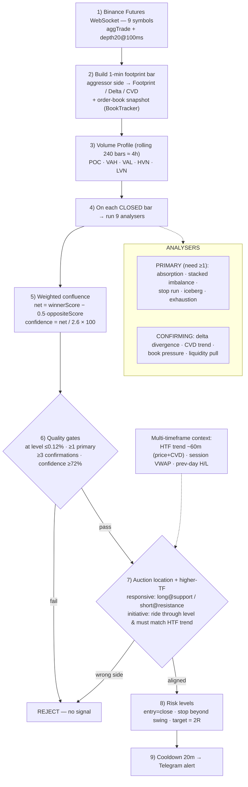

# AuraOrderFlow — strategy flow

How one **closed 1-minute footprint bar** travels from raw Binance data to a
Telegram signal. (Rendered image: [`strategy_flow.png`](strategy_flow.png).)

## Timeframes & how the market is checked (multi-timeframe)

* **Execution timeframe:** 1-minute footprint bars (`bar_period_seconds: 60`).
  Every time a 1-minute bar closes, the full 9-analyser + gate pipeline runs.
* **Structure / context:** a rolling **volume profile over the last 240 bars
  (~4 hours)** supplies POC / VAH / VAL / HVN / LVN, plus recent swings.
* **Higher-timeframe trend (~60m):** `htf_lookback_minutes` (default 60) — the
  bias is *long* only when price **and** cumulative delta both rose over the
  window, *short* when both fell, else neutral. **Initiative (continuation)
  trades must agree with this bias** or they are rejected; **responsive
  (reversal) trades at a level are allowed to fade it**; aligned trades get a
  confidence bonus.
* **Session VWAP** and **previous-day high/low** are added as structural levels
  (so signals can trigger at them, with correct support/resistance side).
* **Liquidity context:** the last 60 order-book snapshots (BookTracker) feed the
  DOM-pressure and liquidity-pull analysers.

So the engine reads **1-minute order flow, against a ~4h profile, filtered by a
~60m trend, anchored on session VWAP and prior-day levels** — a genuine
multi-timeframe order-flow stack. All of it is tunable in `config.yaml`
(`htf_lookback_minutes`, `require_htf_alignment`, `use_vwap`,
`use_prev_day_levels`).
