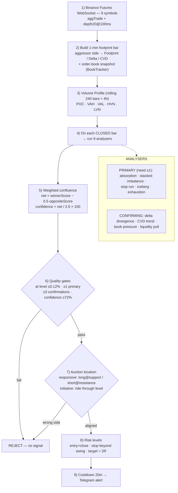

# AuraOrderFlow — strategy flow

How one **closed 1-minute footprint bar** travels from raw Binance data to a
Telegram signal. (Rendered image: [`strategy_flow.png`](strategy_flow.png).)

## Timeframes & how the market is checked

* **Execution timeframe:** 1-minute footprint bars (`bar_period_seconds: 60`).
  Every time a 1-minute bar closes, the full 9-analyser + gate pipeline runs.
* **Structure / context:** a rolling **volume profile over the last 240 bars
  (~4 hours)** supplies POC / VAH / VAL / HVN / LVN, and the last ~25 bars supply
  recent swing high/low. These are the levels signals must occur *at*.
* **Liquidity context:** the last 60 order-book snapshots (BookTracker) feed the
  DOM-pressure and liquidity-pull analysers.

This is a **single-timeframe** intraday order-flow engine: 1-minute flow read
against a 4-hour structural backdrop. It is **not** multi-timeframe — it does not
yet add a higher-timeframe trend filter, session VWAP, or daily/weekly levels.
Those are the natural next layer if multi-timeframe confluence is wanted.
